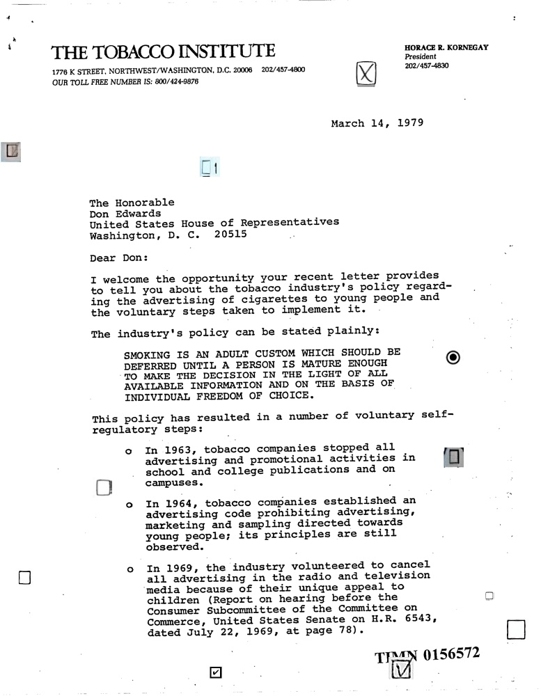
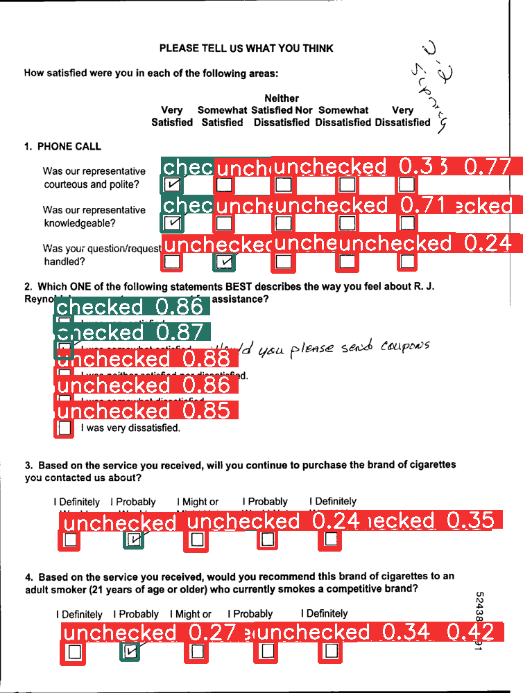

<div id="top"></div>

<!-- PROJECT SHIELDS -->
<!--
*** I'm using markdown "reference style" links for readability.
*** Reference links are enclosed in brackets [ ] instead of parentheses ( ).
*** See the bottom of this document for the declaration of the reference variables
*** for contributors-url, forks-url, etc. This is an optional, concise syntax you may use.
*** https://www.markdownguide.org/basic-syntax/#reference-style-links
-->


<!-- PROJECT LOGO -->
<br />
<div align="center">

<h3 align="center">Checkbox Detection</h3>

  <p align="center">
    Checkbox Detector Model using YOLOv8 model
    <br />
    <a href="https://huggingface.co/spaces/linhdo/checkbox-detector">View Demo</a>
    ·
    <a href="https://github.com/LynnHaDo/Document-Layout-Analysis/issues">Report Bug</a>
    ·
    <a href="https://github.com/LynnHaDo/Document-Layout-Analysis/issues">Request Feature</a>
  </p>
</div>

<!-- TABLE OF CONTENTS -->
<details>
  <summary>Table of Contents</summary>
  <ol>
    <li>
      <a href="#updates">Updates</a>
    </li>
    <li>
      <a href="#about-the-project">About The Project</a>
      <ul>
        <li><a href="#built-with">Built With</a></li>
      </ul>
    </li>
    <li>
      <a href="#getting-started">Getting Started</a>
      <ul>
        <li><a href="#prerequisites">Prerequisites</a></li>
        <li><a href="#installation">Installation</a></li>
      </ul>
    </li>
    <li><a href="#works-cited">Works Cited</a></li>
    <li><a href="#contact">Contact</a></li>
  </ol>
</details>

<!-- UPDATES -->
## Updates 

In this project, I provided 2 models (classification and detection models) trained on the existing YOLOv8 weights. They are uploaded in my [Hugging Face Space](https://huggingface.co/spaces/linhdo/checkbox-detector) of the project. If you feel the need to use or fine-tune the models in any parts of your work, please cite this repository. Thank you!

<!-- ABOUT THE PROJECT -->
## About The Project

The biggest challenge when I approach this problem is the lack of public datasets that contain documents with checkbox annotations. There are only either images of checkboxes alone, or images of scanned documents. As a result, the solution comes down to generating a sufficiently large annotated dataset of document with checkboxes. 

Although the idea of using the Copy-Paste technique in augmenting data is simple, how to make that augmented dataset works well with the existing YOLO architecture is the most difficult part, which takes a lot of trial and error. Throughout this process, I experimented with different ways to paste the checkboxes onto the documents, which include pasting boxes contiguously in horizontal and vertical directions, pasting distractors, adding "background" images, pasting while also avoiding text blocks (using the Document Layout Analysis model I created), etc. I ended with over 10,000 images for the training dataset, and to test the model's performance, an additional 150 human-annotated documents are used as the validation dataset. The annotations are in YOLO format (normalized bounding boxes).



```sh
    1 0.402831 0.965 0.048906 0.032
    0 0.904762 0.856 0.018018 0.014
    0 0.189189 0.7005 0.036036 0.029
    0 0.388031 0.2395 0.037323 0.029
    1 0.0199485 0.2185 0.037323 0.029
    1 0.741313 0.96 0.046332 0.032
    1 0.677606 0.1045 0.047619 0.041
    0 0.956242 0.9045 0.041184 0.033
    1 0.838481 0.6575 0.037323 0.029
    1 0.837838 0.514 0.03861 0.03
    0 0.0456885 0.8305 0.032175 0.027
```

The model was trained on a GPU P100 for 200 epochs. In the end, under the supervision and mentorship of my advisor, I was able to achieve notable inference results, with the model achieving relatively high precision and recall rates after ~100 epochs. 




<p align="right">(<a href="#top">back to top</a>)</p>


### Built With

* [YOLOv8](https://ultralytics.com/yolov8)
* [Gradio](https://www.gradio.app/)
* [Hugging Face Space](https://huggingface.co/spaces)
* [Kaggle](https://www.kaggle.com/)

<p align="right">(<a href="#top">back to top</a>)</p>

<!-- GETTING STARTED -->
### Prerequisites

#### For generating data
1. opencv-python
2. matplotlib
3. numpy
4. albumentations

#### For training
1. ultralytics
2. gradio
3. torch
4. ruamel

### Installation

1. Clone the repo
   
   ```sh
   git clone https://github.com/LynnHaDo/Checkbox-Detection.git
   ```
   
2. Install packages
   
   ```sh
   pip install opencv-python
   pip install matplotlib
   pip install numpy
   pip install albumentations
   pip install ultralytics
   pip install gradio
   pip install torch
   pip install ruamel
   ```
3. Dataset:

- Source documents: RVL-CDIP
- Checkboxes images: currently not publicly available

<p align="right">(<a href="#top">back to top</a>)</p>

<!-- WORKS CITED -->
## Works Cited

1. Ultralytics YOLOv8
   
   ```sh
   authors:
    - family-names: Jocher
      given-names: Glenn
      orcid: "https://orcid.org/0000-0001-5950-6979"
    - family-names: Chaurasia
      given-names: Ayush
      orcid: "https://orcid.org/0000-0002-7603-6750"
    - family-names: Qiu
      given-names: Jing
      orcid: "https://orcid.org/0000-0003-3783-7069"
   title: "YOLO by Ultralytics"
   version: 8.0.0
   date-released: 2023-1-10
   license: AGPL-3.0
   url: "https://github.com/ultralytics/ultralytics"
   ```
   
2. RVL-CDIP dataset
   
   ```sh
   @inproceedings{harley2015icdar,
    title = {Evaluation of Deep Convolutional Nets for Document Image Classification and Retrieval},
    author = {Adam W Harley and Alex Ufkes and Konstantinos G Derpanis},
    booktitle = {International Conference on Document Analysis and Recognition ({ICDAR})}},
    year = {2015}
    }
   ```
   
3. Doclaynet-base dataset

   ```sh
   @article{doclaynet2022,
    title = {DocLayNet: A Large Human-Annotated Dataset for Document-Layout Segmentation},
    doi = {10.1145/3534678.353904},
    url = {https://doi.org/10.1145/3534678.3539043},
    author = {Pfitzmann, Birgit and Auer, Christoph and Dolfi, Michele and Nassar, Ahmed S and Staar, Peter W J},
    year = {2022},
    isbn = {9781450393850},
    publisher = {Association for Computing Machinery},
    address = {New York, NY, USA},
    booktitle = {Proceedings of the 28th ACM SIGKDD Conference on Knowledge Discovery and Data Mining},
    pages = {3743–3751},
    numpages = {9},
    location = {Washington DC, USA},
    series = {KDD '22}
    }
   ```

4. XFUND dataset
   
   ```sh
   @inproceedings{xu-etal-2022-xfund,
    title = "{XFUND}: A Benchmark Dataset for Multilingual Visually Rich Form Understanding",
    author = "Xu, Yiheng  and
      Lv, Tengchao  and
      Cui, Lei  and
      Wang, Guoxin  and
      Lu, Yijuan  and
      Florencio, Dinei  and
      Zhang, Cha  and
      Wei, Furu",
    booktitle = "Findings of the Association for Computational Linguistics: ACL 2022",
    month = may,
    year = "2022",
    address = "Dublin, Ireland",
    publisher = "Association for Computational Linguistics",
    url = "https://aclanthology.org/2022.findings-acl.253",
    doi = "10.18653/v1/2022.findings-acl.253",
    pages = "3214--3224",
    abstract = "Multimodal pre-training with text, layout, and image has achieved SOTA performance for visually rich document understanding tasks recently, which demonstrates the great potential for joint learning across different modalities. However, the existed research work has focused only on the English domain while neglecting the importance of multilingual generalization. In this paper, we introduce a human-annotated multilingual form understanding benchmark dataset named XFUND, which includes form understanding samples in 7 languages (Chinese, Japanese, Spanish, French, Italian, German, Portuguese). Meanwhile, we present LayoutXLM, a multimodal pre-trained model for multilingual document understanding, which aims to bridge the language barriers for visually rich document understanding. Experimental results show that the LayoutXLM model has significantly outperformed the existing SOTA cross-lingual pre-trained models on the XFUND dataset. The XFUND dataset and the pre-trained LayoutXLM model have been publicly available at https://aka.ms/layoutxlm.",
    }
   ```

<!-- CONTACT -->
## Contact

Linh Do - do24l@mtholyoke.edu/dohalinh2303@gmail.com (personal)

Project Link: [https://github.com/LynnHaDo/Checkbox-Detection](https://github.com/LynnHaDo/Checkbox-Detection)

LinkedIn: [https://linkedin.com/in/Linh Do](https://www.linkedin.com/in/linh-do-0327371b2/)

<p align="right">(<a href="#top">back to top</a>)</p>

