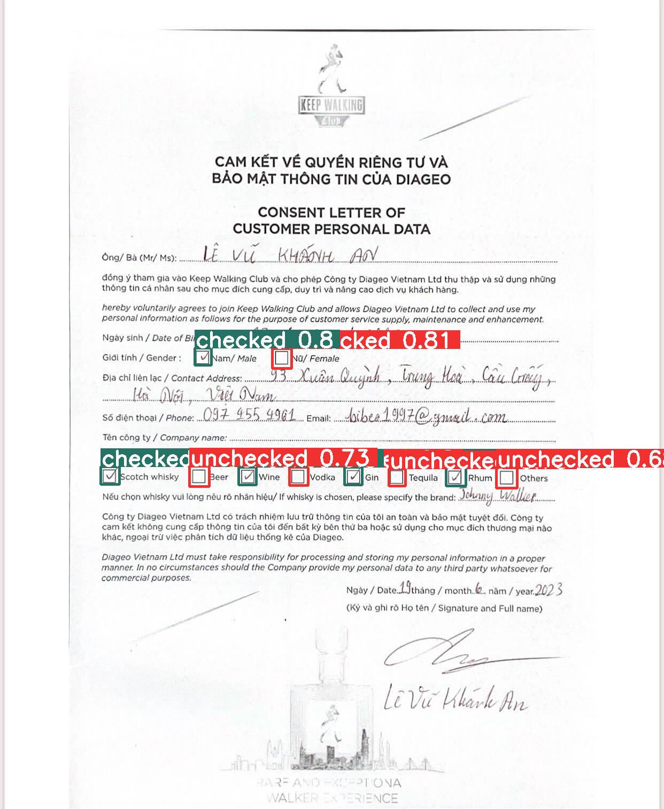

<div id="top"></div>

<!-- PROJECT SHIELDS -->
<!--
*** I'm using markdown "reference style" links for readability.
*** Reference links are enclosed in brackets [ ] instead of parentheses ( ).
*** See the bottom of this document for the declaration of the reference variables
*** for contributors-url, forks-url, etc. This is an optional, concise syntax you may use.
*** https://www.markdownguide.org/basic-syntax/#reference-style-links
-->


<!-- PROJECT LOGO -->
<br />
<div align="center">

<h3 align="center">Checkbox Detection</h3>

  <p align="center">
    Checkbox Detector Model using YOLOv8 model
    <br />
    <a href="https://huggingface.co/spaces/linhdo/checkbox-detector">View Demo</a>
    ·
    <a href="https://github.com/LynnHaDo/Document-Layout-Analysis/issues">Report Bug</a>
    ·
    <a href="https://github.com/LynnHaDo/Document-Layout-Analysis/issues">Request Feature</a>
  </p>
</div>

<!-- TABLE OF CONTENTS -->
<details>
  <summary>Table of Contents</summary>
  <ol>
    <li>
      <a href="#about-the-project">About The Project</a>
      <ul>
        <li><a href="#built-with">Built With</a></li>
      </ul>
    </li>
    <li>
      <a href="#getting-started">Getting Started</a>
      <ul>
        <li><a href="#prerequisites">Prerequisites</a></li>
        <li><a href="#installation">Installation</a></li>
      </ul>
    </li>
    <li><a href="#contact">Contact</a></li>
  </ol>
</details>


<!-- ABOUT THE PROJECT -->
## About The Project



<p align="right">(<a href="#top">back to top</a>)</p>


### Built With

* [YOLOv8](https://ultralytics.com/yolov8)
* [Gradio](https://www.gradio.app/)
* [Kaggle]

<p align="right">(<a href="#top">back to top</a>)</p>

<!-- GETTING STARTED -->
### Prerequisites

1. opencv-python
2. matplotlib
3. numpy
4. albumentations
5. ultralytics
6. gradio

### Installation

1. Clone the repo
   ```sh
   git clone https://github.com/LynnHaDo/Checkbox-Detection.git
   ```
2. Install packages
   ```sh
   pip install opencv-python
   pip install matplotlib
   pip install numpy
   pip install albumentations
   pip install ultralytics
   pip install gradio
   ```
3. Dataset:
   - Source documents: RVL-CDIP
   - Checkboxes images: currently not publicly available

<p align="right">(<a href="#top">back to top</a>)</p>

<!-- CONTACT -->
## Contact

Linh Do - do24l@mtholyoke.edu/dohalinh2303@gmail.com (personal)

Project Link: [https://github.com/LynnHaDo/Checkbox-Detection](https://github.com/LynnHaDo/Checkbox-Detection)

LinkedIn: [https://linkedin.com/in/Linh Do](https://www.linkedin.com/in/linh-do-0327371b2/)

<p align="right">(<a href="#top">back to top</a>)</p>

